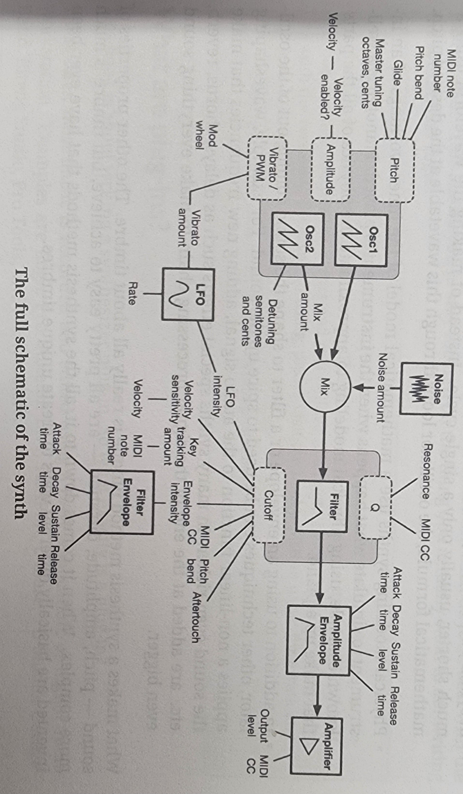
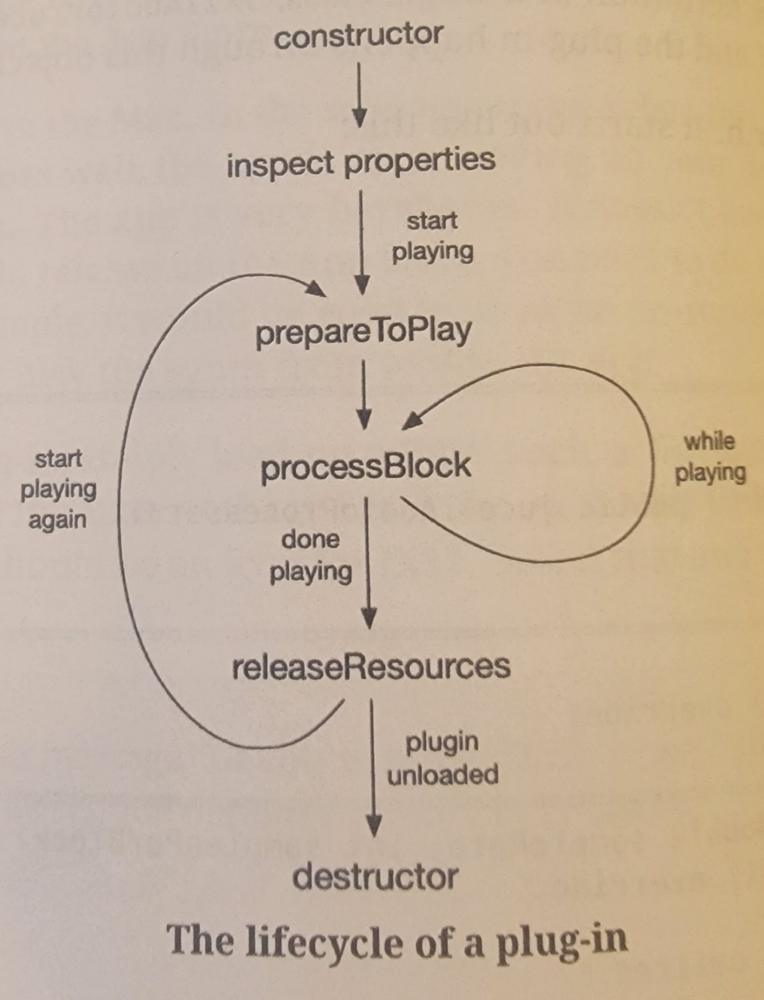

# JX11 Synthesizer

This is the jx11 digital synthesizer The Audio Programmer's book ["Creating Synthesizer Plug-Ins with C++ and JUCE"](https://www.theaudioprogrammer.com/synth-plugin-book) by Matthijs Hollemans.

# Architecture

## Schematic

Above is the general signal flow schematic of this plugin. The image is taken directly from the book.

## Plugin lifecycle

above is the lifecycle of most audio plugins, and is true for this plugin. The image is taken directly from the book.

# Useful Links

### The Audio Programer

[JX11 Source Code](https://github.com/TheAudioProgrammer/synth-plugin-book)

### JUCE

[JUCE API documentation](https://docs.juce.com)

[JUCE Tutorials](https://juce.com/learn/tutorials)

[JUCE Forums](https://forum.juce.com)

[JUCE Source Code](https://github.com/juce-framework/JUCE)

### MIDI

[Official MIDI Specifications](https://www.midi.org/specifications)

[Summary of MIDI 1.0 Messages](https://www.midi.org/specifications-old/item/table-1-summary-of-midi-message)

[MIDI 2.0 Specifications](https://www.midi.org/specifications/midi-2-0-specifications)

### Synth

[BLIT synth](https://ccrma.stanford.edu/~stilti/papers/blit.pdf)

[Osc and Filter algorithms for Analog Synthesis](https://www.researchgate.net/publication/220386519_Oscillator_and_Filter_Algorithms_for_Virtual_Analog_Synthesis)

[Graphing Calculator](https://www.desmos.com/calculator)

### User Presets

[Youtube Tutorial](https://www.youtube.com/watch?v=YwAtWuGA4Cg)

[Open Source Implementation](https://github.com/Chowdhury-DSP/chowdsp_utils)